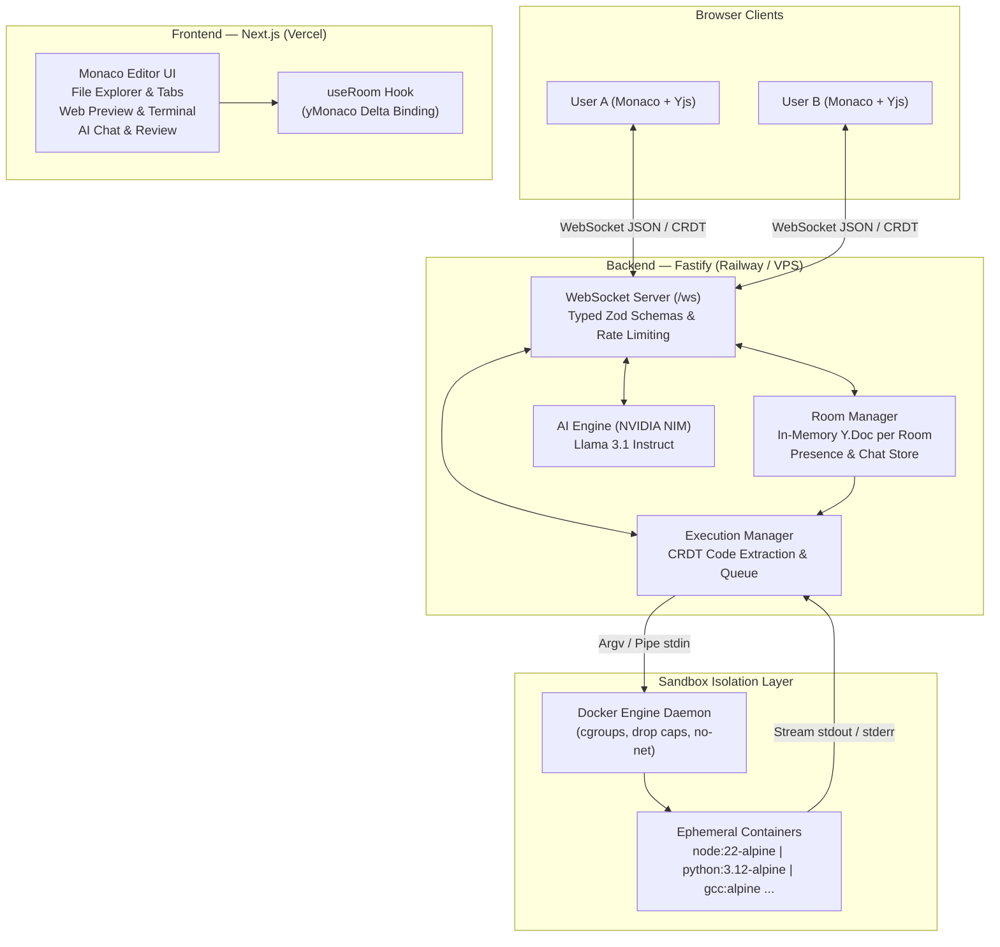

# SandboxRoom — Complete Technical Documentation

> **Next-Generation Real-Time Collaborative Code Sandbox with Isolated Docker Execution & AI Assistance**

---

## 1. Executive Summary

**SandboxRoom** is a full-stack, browser-based collaborative developer environment (IDE) built for competitive programming, pair programming, technical interviews, and real-time remote debugging. 

Multiple users can join a room via a single URL, concurrently edit code across multiple files with conflict-free convergence, execute code across 10+ programming languages inside isolated ephemeral Docker containers, interact with an AI code assistant, and inspect live stdout/stderr streams simultaneously.

### Key Highlights
- **Conflict-Free Real-Time Collaboration**: Powered by Yjs CRDTs with granular Monaco editor delta synchronization.
- **True Multi-Cursor Presence**: Visual presence badges, remote cursor tracking, selection highlights, and in-room chat.
- **Secure Sandboxed Execution**: Ephemeral Docker containers with zero network access, read-only root filesystems, strict CPU/Memory cgroups, and PIDs limits.
- **Multi-Language Support**: Node.js, TypeScript, Python, C++, C, Go, Rust, Java, Bash, Ruby, and PHP.
- **Built-in AI Assistant**: Real-time code review, bug explanation, autocomplete, and contextual chat via NVIDIA NIM (Llama 3.1).
- **In-Browser Web Preview & Test Runner**: Real-time iframe preview for web apps and parameterized test runner for coding challenges.
- **Instant Snapshots & ZIP Export**: In-memory versioning and one-click project download.

---

## 2. System Architecture



### Data Flow Overview

1. **State Synchronization (CRDT)**:
   - Every file is represented by a `Y.Text` object within a room's `Y.Doc`.
   - Monaco keystrokes produce fine-grained character deltas converted into Yjs binary updates.
   - Updates are base64-encoded and sent over WebSocket as `CRDT_UPDATE`.
   - The server applies the update to its canonical in-memory `Y.Doc` and broadcasts it to all other peers.

2. **Execution Flow (Zero-Trust Browser)**:
   - When a user clicks **Run**, the client sends a `RUN_CODE` message carrying *only* the `fileId` and target language.
   - The server extracts the code directly from its own server-side CRDT copy. **Clients cannot inject arbitrary payload strings into the runner**.
   - The server spawns a pre-pulled Alpine Docker container with `--net=none`, `--memory=128m`, and drops all capabilities.
   - The code is piped via `stdin` directly into the runtime interpreter/compiler.
   - Real-time output chunks are streamed back to the room's terminal over WebSockets (`STDOUT`, `STDERR`).
   - The container is unconditionally force-removed (`docker rm -f`) in a `finally` block upon completion or timeout.

---

## 3. Technology Stack

| Layer | Technologies | Rationale |
|---|---|---|
| **Frontend Framework** | Next.js 14 (App Router), React 18, TypeScript | Fast server rendering, clean routing, optimal for Vercel deployment |
| **Code Editor** | Monaco Editor (`@monaco-editor/react`) | VS Code-grade editor with syntax highlighting, IntelliSense, and minimap |
| **CRDT Engine** | Yjs (`yjs`) | Industry-standard, mathematically proven CRDT for conflict-free text sync |
| **Styling** | Tailwind CSS + Custom CSS Variables | Sleek, dark-mode first, glassmorphic UI layout |
| **Backend Server** | Fastify 5, Node.js 22 | Ultra-low overhead HTTP & WebSocket server |
| **WebSocket** | `ws` + custom typed protocol with Zod | High-throughput binary/JSON framing, strict input validation |
| **Isolation / Runtime** | Docker Engine (CLI via non-shell `spawn`) | Process isolation, cgroups v2 limits, ephemeral execution |
| **AI Integration** | NVIDIA NIM API (`meta/llama-3.1-8b-instruct`) | Low-latency code review, completion, and interactive chat |
| **Monorepo Tooling** | NPM Workspaces, TypeScript Project References | Clean code sharing between `packages/shared`, `apps/server`, and `apps/web` |

---

## 4. Project Structure

```
collab-sandbox/
├── apps/
│   ├── server/                     # Backend Fastify + WebSockets + Docker runner
│   │   ├── src/
│   │   │   ├── ai.ts               # NVIDIA NIM integration (chat, review, error explanation)
│   │   │   ├── config.ts           # Environment variables & runtime limits
│   │   │   ├── execution.ts        # Run validation, CRDT code extraction, lifecycle
│   │   │   ├── index.ts            # Fastify REST endpoints & server boot
│   │   │   ├── log.ts              # Timestamped color logger
│   │   │   ├── rooms.ts            # In-memory Y.Doc, user presence, chat history
│   │   │   ├── websocket.ts        # WS upgrade, origin check, message routing
│   │   │   └── sandbox/
│   │   │       ├── docker.ts       # DockerRuntime: container creation, stdin pipe, cleanup
│   │   │       ├── firecracker.ts  # FirecrackerRuntime microVM stub (future roadmap)
│   │   │       └── types.ts        # SandboxRuntime interface & contracts
│   │   └── scripts/
│   │       ├── test-collab.ts      # Automated CRDT & protocol test suite (9 test cases)
│   │       └── test-sandbox.ts     # Automated Docker sandbox limits test suite
│   │
│   └── web/                        # Next.js 14 Frontend UI
│       ├── app/
│       │   ├── globals.css         # Theme styles, Monaco remote cursor animations
│       │   ├── layout.tsx          # Root layout & font injection
│       │   ├── page.tsx            # Landing page (create room, quick join)
│       │   └── room/[roomId]/      # Main IDE collaborative workspace
│       ├── components/
│       │   ├── AiChatPanel.tsx     # Context-aware AI chat sidebar
│       │   ├── AiReviewPanel.tsx   # Automated code diagnostics & suggestions
│       │   ├── Chat.tsx            # Real-time room participant chat
│       │   ├── CodeEditor.tsx      # Monaco editor instance with remote cursor widgets
│       │   ├── FileExplorer.tsx    # Multi-file management (create, rename, delete)
│       │   ├── FileTabs.tsx        # File switching tabs with active indicators
│       │   ├── RightPanel.tsx      # Multi-mode right panel (Terminal, Preview, AI, Tests)
│       │   ├── SandboxPanel.tsx    # Resource metrics & execution control
│       │   ├── SnapshotsModal.tsx  # In-memory workspace snapshot gallery
│       │   ├── StatusBar.tsx       # WebSocket health, runtime status, active users
│       │   ├── Terminal.tsx        # ANSI terminal emulator with live execution output
│       │   ├── TestRunner.tsx      # Automated test case input/expected output runner
│       │   ├── TopBar.tsx          # Room link copy, language picker, run/stop button
│       │   └── WebPreview.tsx      # Live HTML/JS/CSS sandboxed iframe preview
│       ├── hooks/
│       │   └── useRoom.ts          # Central WebSocket, CRDT sync, and presence hook
│       └── lib/
│           ├── config.ts           # Public API & WebSocket URLs
│           ├── language.ts         # Language registry & boilerplate templates
│           ├── yMonaco.ts          # Bidirectional Y.Text <-> Monaco delta synchronization
│           └── zip.ts              # Client-side project export to ZIP
│
├── packages/
│   └── shared/                     # Shared TypeScript schemas & protocol definitions
│       └── src/
│           ├── index.ts            # Entrypoint export
│           └── protocol.ts         # Zod schemas for all client/server WebSocket frames
│
├── docs/                           # Architecture, Security, and Demo guides
│   ├── architecture.md
│   ├── demo.md
│   └── security.md
└── package.json                    # Monorepo root package.json
```

---

## 5. Core Features Deep Dive

### 5.1 Real-Time Collaborative Editing (CRDT)
- **Monaco Delta Binding**: Rather than synchronizing entire document strings on every stroke, `apps/web/lib/yMonaco.ts` listens to Monaco's `onDidChangeModelContent`. It converts changes into minimal offset deltas and applies them to the local `Y.Text`.
- **Echo Suppression**: A boolean latch prevents remote CRDT updates applied to Monaco from re-triggering local edit events, preventing infinite broadcast loops.
- **Idempotent Reconnect**: If a client temporarily disconnects, it fetches the full canonical binary state from the server on reconnect, merges it locally with any offline edits, and immediately converges.

### 5.2 Multi-Cursor Presence & Remote Cursors
- Each user is assigned an ID, a color, and a display name.
- Cursor positions (`anchor`, `head`) are transmitted across the WebSocket via `CURSOR_UPDATE`.
- The frontend renders remote cursors using Monaco **Content Widgets** and **Inline Decorations**:
  - Remote selection highlights with user-specific opacity (`.rc-sel-*`).
  - Smooth blinking vertical carets with attached user name chips (`.rc-label-*`).

### 5.3 Multi-File Virtual Workspace
- Collaborative file tree stored in a Yjs `Y.Map<FileMeta>("files")`.
- Users can create, delete, and switch between files in real-time.
- File creations and deletions are synced instantly to all collaborators in the room.

### 5.4 Docker-Isolated Multi-Language Execution
Code is executed in ephemeral, resource-constrained containers:

| Language | Container Image | Execution Method |
|---|---|---|
| **JavaScript** | `node:22-alpine` | `node /tmp/main.js` |
| **TypeScript** | `node:22-alpine` | `node --experimental-strip-types /tmp/main.ts` |
| **Python** | `python:3.12-alpine` | `python3 -u /tmp/main.py` |
| **C / C++** | `gcc:alpine` | `g++ -O2 /tmp/main.cpp -o /tmp/a.out && /tmp/a.out` |
| **Go** | `golang:1.23-alpine` | `go run /tmp/main.go` |
| **Rust** | `rust:1.82-alpine` | `rustc /tmp/main.rs -o /tmp/a.out && /tmp/a.out` |
| **Java** | `eclipse-temurin:21-alpine`| `java /tmp/Main.java` |
| **Bash** | `bash:alpine` | `bash /tmp/script.sh` |
| **Ruby** | `ruby:3.3-alpine` | `ruby /tmp/main.rb` |
| **PHP** | `php:8.3-cli-alpine` | `php /tmp/main.php` |

### 5.5 AI Code Assistant
- Powered by **NVIDIA NIM** with `meta/llama-3.1-8b-instruct`.
- **Interactive Chat**: Chat sidebar aware of your active code, language, and project files.
- **Code Review**: Analyzes code for security flaws, memory leaks, performance bottlenecks, and style bugs with one click.
- **Explain Error**: When a program crashes with a stack trace, clicking "Explain with AI" provides an instant natural language diagnosis and solution.

---

## 6. Security & Sandboxing Model

The execution sandbox implements strict multi-layer containment:

| Security Layer | Implementation | Threat Mitigated |
|---|---|---|
| **Network Isolation** | `--net=none` | Disables outbound socket creation, preventing DDoS, cryptocurrency mining, and port scanning |
| **Read-Only Root FS** | `--read-only` | Prevents file tampering, kernel module tampering, and persistence |
| **Memory Limit** | `--memory=128m --memory-swap=128m` | Prevents OOM crashes of the host machine |
| **CPU Quotas** | `--cpus=0.5` | Prevents 100% CPU lockup from infinite loops |
| **Process Limits** | `--pids-limit=64` | Completely neutralizes fork bombs (`:(){ :\|:& };:`) |
| **Execution Timeout** | `5000 ms` strict timer | Automatically terminates unresponsive processes with `docker kill` |
| **Output Flooding** | Hard cap at 64 KB | Prevents memory exhaustion from runaway `while(true) console.log(1)` |
| **No Shell Injection** | `spawn("docker", args)` with argv arrays | No `sh -c` or shell strings used anywhere in the codebase |

---

## 7. WebSocket Protocol Specification

The WebSocket endpoint is exposed at `/ws`. All frames are typed JSON.

### Client Messages (Browser -> Server)
```json
// Join a room
{ "type": "JOIN_ROOM", "roomId": "a1b2c3d4e5", "name": "Alice" }

// Broadcast CRDT delta
{ "type": "CRDT_UPDATE", "update": "<base64_encoded_yjs_update>" }

// Update cursor & selection
{ "type": "CURSOR_UPDATE", "anchor": 120, "head": 120 }

// Execute code
{ "type": "RUN_CODE", "fileId": "main", "language": "python" }

// Abort active execution
{ "type": "STOP_CODE" }

// In-room chat message
{ "type": "CHAT_MESSAGE", "text": "Can you check line 42?" }
```

### Server Messages (Server -> Client)
```json
// Initial sync upon joining
{ "type": "SYNC_STATE", "update": "<base64>", "you": { "id": "user_1", "name": "Alice", "color": "#6aa7ff" }, "users": [...] }

// Execution started
{ "type": "EXECUTION_STARTED", "executionId": "exec_8f3a", "startedBy": "Alice", "limits": { "timeoutMs": 5000, "memory": "128m" } }

// Live stdout/stderr chunk
{ "type": "STDOUT", "executionId": "exec_8f3a", "data": "Hello World\n" }

// Execution finished
{ "type": "EXECUTION_COMPLETED", "executionId": "exec_8f3a", "exitCode": 0, "durationMs": 412 }
```

---

## 8. Local Setup & Testing

### Prerequisites
- Node.js 20+ (tested on Node 22)
- Docker Desktop or Docker Engine running
- Git

### Installation & Run
```bash
# 1. Clone repository
git clone https://github.com/Niharika00000/CodeSandboxVM.git
cd CodeSandboxVM

# 2. Install monorepo dependencies
npm install

# 3. Pull sandbox runtime images
npm run docker:pull

# 4. Start development servers (Fastify on :4000, Next.js on :3000)
npm run dev
```

Open `http://localhost:3000` in two separate browser windows to test real-time collaboration.

### Running Automated Test Suites
```bash
# Start backend server
npm run dev -w @sandbox/server

# In a separate terminal:
npm run test:collab     # Verifies Yjs CRDT convergence, origin rejection, and schema validation
npm run test:sandbox    # Verifies Docker memory caps, fork bomb containment, and timeouts
```

---

## 9. Production Deployment Guide

### Architecture: Split Deployment (Railway + Vercel)

```
┌──────────────────────────────────────┐       ┌──────────────────────────────────────┐
│          Next.js Frontend            │       │         Fastify Server               │
│         Hosted on: VERCEL            │       │        Hosted on: RAILWAY            │
│  https://your-app.vercel.app         │       │  https://your-api.up.railway.app     │
└──────────────────┬───────────────────┘       └──────────────────┬───────────────────┘
                   │                                              │
                   │ WebSocket wss://...                          │
                   └──────────────────────────────────────────────┘
```

#### Step 1: Deploy Backend to Railway
1. Go to [railway.app](https://railway.app) and sign in with GitHub.
2. Click **New Project** > **Deploy from GitHub repo** > select `Niharika00000/CodeSandboxVM`.
3. In the service **Settings**:
   - **Build Command**: `npm install`
   - **Start Command**: `npm run start -w @sandbox/server`
4. In the **Variables** tab, add:
   - `HOST` = `0.0.0.0`
   - `WEB_ORIGIN` = `*`
   - `NVIDIA_API_KEY` = `<your_key>`
5. In **Settings** > **Networking**, click **Generate Domain**. Copy the generated URL (e.g., `codesandboxvm-production.up.railway.app`).

#### Step 2: Deploy Frontend to Vercel
1. Go to [vercel.com](https://vercel.com) and sign in with GitHub.
2. Click **Add New...** > **Project** > import `Niharika00000/CodeSandboxVM`.
3. Configure the deployment:
   - **Root Directory**: `apps/web`
   - **Framework Preset**: Next.js
4. In **Environment Variables**, add:
   - `NEXT_PUBLIC_API_URL` = `https://your-railway-url.up.railway.app`
   - `NEXT_PUBLIC_WS_URL` = `wss://your-railway-url.up.railway.app/ws`
5. Click **Deploy**.

---

## 10. Future Roadmap

- **Firecracker microVM Runtime**: Transition from Docker containers to hardware-virtualized microVMs with dedicated guest kernels (`FirecrackerRuntime`), using `vsock` agents.
- **Warm VM Pool**: Maintain a pool of pre-booted microVM snapshots to reduce execution latency from ~300ms to <15ms.
- **Horizontal Scaling with Redis**: Integrate Redis Pub/Sub to allow WebSocket rooms to scale across multiple server nodes.
- **Persistent Git Sync**: Add two-way synchronization with GitHub repositories and branches.
